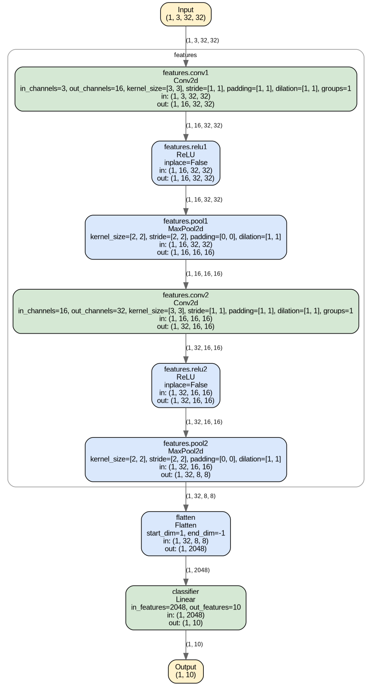
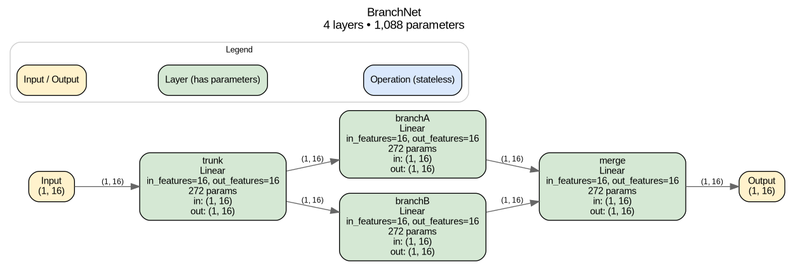

# TorchSharpVisual

[](https://github.com/JacobGoodchild/TorchSharpVisual/actions/workflows/ci.yml)
[](https://www.nuget.org/packages/TorchSharpVisual)
[](https://www.nuget.org/packages/TorchSharpVisual)
[](LICENSE)
[](#)

**TorchSharpVisual** draws clean, color-coded architecture diagrams for [TorchSharp](https://github.com/dotnet/TorchSharp) models — the same idea as Python's [`torchview`](https://github.com/mert-kurttutan/torchview) and [`visualkeras`](https://github.com/paulgavrikov/visualkeras), but for .NET.

Give it a model and an input shape, and it hands back a PNG, SVG, or raw Graphviz `.dot` file showing every layer, how data actually flows between them (including branches and merges, not just a straight chain), the parameter count and tensor shape at each step, and a summary of the whole model.

<p align="center">
  
</p>

Branching models — a shared trunk feeding parallel branches that merge back together — are diagrammed correctly too, not flattened into a misleading straight line:

<p align="center">
  
</p>

## Features

- 🔍 **Automatic inspection** — recursively walks a model's sub-modules, no manual annotation needed.
- 📐 **Real shapes, not guesses** — runs one dummy forward pass and records the actual tensor shape flowing into and out of every layer.
- 🔀 **Real dataflow, not just execution order** — edges are built from actual tensor identity, so a shared trunk feeding multiple branches is drawn as a genuine fork, not a misleading straight chain (see [How it works](#how-it-works) for the one topology this can't see).
- 🧮 **Parameter counts** — every layer reports its learnable parameter count, and each diagram gets a summary header with the model's total layer and parameter counts.
- 🎨 **Color-coded by role** so a diagram reads at a glance:
  - 🟡 **Amber** — the input/output tensors
  - 🟢 **Green** — layers with learnable parameters (`Linear`, `Conv2d`, `BatchNorm2d`, …)
  - 🔵 **Blue** — stateless operations (`ReLU`, `Softmax`, `MaxPool2d`, `Flatten`, …)
  - A legend explaining this is drawn on the diagram itself by default.
- 📦 **Groups nested containers** — a `Sequential` block nested inside a bigger model is drawn as a labeled cluster, so structure stays visible.
- ⚙️ **Configurable rendering** — top-to-bottom or left-to-right layout, DPI, font, and toggles for the legend/parameter counts/summary header via `RenderOptions`.
- 🖼️ **PNG, SVG, or raw DOT** — render an image via your local Graphviz install, or grab the `.dot` source directly with zero external dependencies.
- 🧩 **One-line API** — `model.DrawGraph(...)` and you're done.

## Installation

```bash
dotnet add package TorchSharpVisual
```

You'll also need **Graphviz** installed if you want PNG/SVG output (raw `.dot` output has no external dependency):

```bash
# Ubuntu/Debian
sudo apt-get update && sudo apt-get install -y graphviz

# macOS
brew install graphviz

# Windows
choco install graphviz
```

Verify it's on `PATH`:

```bash
dot -V
```

## Quick start

```csharp
using TorchSharp;
using TorchSharpVisual.Extensions;
using static TorchSharp.torch;

// Any TorchSharp nn.Module<Tensor, Tensor> — Sequential or a custom class.
var model = nn.Sequential(
    ("conv1", nn.Conv2d(3, 16, kernel_size: 3, padding: 1)),
    ("relu1", nn.ReLU()),
    ("pool1", nn.MaxPool2d(kernel_size: 2)),
    ("flatten", nn.Flatten()),
    ("fc", nn.Linear(16 * 16 * 16, 10)));

model.DrawGraph(inputShape: new long[] { 1, 3, 32, 32 }, fileName: "architecture.png");
```

That's it — `architecture.png` now shows the full model, labeled with layer names, types, parameter counts, and tensor shapes at every step, plus a summary header and legend.

Other useful calls:

```csharp
// SVG instead of PNG — same call, different extension.
model.DrawGraph(inputShape: new long[] { 1, 3, 32, 32 }, fileName: "architecture.svg");

// Raw Graphviz DOT source, no Graphviz install required.
model.DrawGraph(inputShape: new long[] { 1, 3, 32, 32 }, fileName: "architecture.dot");
string dot = model.ToDotGraph(inputShape: new long[] { 1, 3, 32, 32 });

// Give the diagram a friendlier title than the C# class name.
model.DrawGraph(inputShape: new long[] { 1, 3, 32, 32 }, fileName: "architecture.png", modelName: "MyConvNet");

// Customize layout and what gets shown.
model.DrawGraph(
    inputShape: new long[] { 1, 3, 32, 32 },
    fileName: "architecture.png",
    options: new RenderOptions
    {
        LayoutDirection = GraphLayoutDirection.LeftToRight,
        ShowLegend = false,
        ShowParameterCounts = true,
        Dpi = 150,
    });
```

See `samples/TorchSharpVisual.Sample` for a runnable console app covering a `Sequential` conv net, a
custom multi-layer classifier, and a branching (fork/join) model:

```bash
dotnet run --project samples/TorchSharpVisual.Sample
```

## How it works

1. **`TorchSharpVisual.Extractors.TorchSharpExtractor`** recursively walks the model's sub-modules (`named_modules()`), finds the "leaf" layers (the ones that actually do work), and attaches a forward hook to each. It then runs a single dummy forward pass with a zero-filled tensor of the shape you gave it.
2. As each hook fires, it records that layer's parameter count and the shape of the tensor flowing in and out — and, crucially, it looks up **which earlier layer actually produced the exact tensor object** it just received, using reference identity rather than assuming a straight chain. That's what lets a shared trunk feeding two sibling branches show up as a real fork instead of a fictitious `branchA → branchB` line. When a tensor arrives that no tracked layer produced directly (typically because it passed through a raw tensor operation between modules, like a residual `+`), the extractor falls back to connecting from whichever layers are still "dangling" — produced a tensor nothing has claimed yet — which recovers the common merge/fan-in case.
3. That trace is turned into a plain **`TorchSharpVisual.Core.Graph`** — a list of `Node`s (tensors and layers, with shapes and parameter counts) and `Edge`s (the tensor flow between them) — with no Graphviz or TorchSharp types leaking through.
4. **`TorchSharpVisual.Renderers.DotRenderer`** turns the graph into Graphviz DOT syntax: colors each node by its `NodeKind`, groups nested containers into clusters, adds the legend and summary header, and — for `.png`/`.svg` — shells out to your local `dot` executable to render the image.
5. **`TorchSharpVisual.Extensions.ModuleExtensions`** wraps steps 1–4 into the one-line `model.DrawGraph(...)` / `model.ToDotGraph(...)` calls shown above.

**Known limitation:** this only supports models whose forward pass takes a single `Tensor` and returns a single `Tensor` end to end (the overwhelming majority of `Sequential` stacks and custom feed-forward/convolutional networks — including branching ones, as above). And because dataflow is tracked by watching module calls rather than tracing the model's actual computation graph, a skip connection that stashes a tensor and reuses it much later — after it's already been consumed elsewhere in a way that "claims" it — can't be reconstructed; that one topology needs true autograd-graph tracing, which is on the roadmap (see `CONTRIBUTING.md`).

## Project layout

```
src/TorchSharpVisual/
  Core/          Graph, Node, Edge — the plain data model for a diagram
  Extractors/    TorchSharpExtractor — inspects a model and builds a Graph via tensor-identity tracking
  Renderers/     DotRenderer, RenderOptions — turns a Graph into Graphviz DOT / PNG / SVG
  Extensions/    ModuleExtensions — the model.DrawGraph(...) convenience API
tests/TorchSharpVisual.Tests/
  Unit tests covering extraction (Sequential, custom multi-layer, Conv2d, nested containers,
  branching/fan-out/fan-in, parameter counts) and rendering (DOT syntax, color scheme, legend,
  render options, PNG/SVG generation via Graphviz).
samples/TorchSharpVisual.Sample/
  A runnable console app demonstrating the library on real model shapes.
```

## Running the tests

```bash
dotnet test
```

The rendering tests shell out to a real `dot` executable, so Graphviz needs to be installed to run the full suite (see [Installation](#installation)). CI runs the full build (warnings as errors), test suite, and sample app on every push — see [`.github/workflows/ci.yml`](.github/workflows/ci.yml).

## Contributing

Issues and pull requests are welcome — see [`CONTRIBUTING.md`](CONTRIBUTING.md) for how to get set up and a list of ideas (multi-input/output models, more layer attributes, additional themes, folding repeated blocks). See [`CHANGELOG.md`](CHANGELOG.md) for release history.

## License

[MIT](LICENSE)
